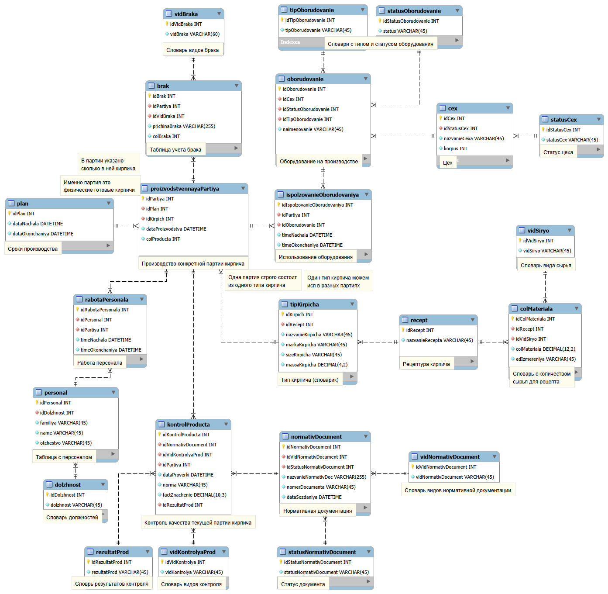

# База данных производства кирпича

Учебный проект по дисциплине **«Проектирование информационных систем и баз данных»**.
Реализована реляционная база данных, моделирующая производственный процесс
кирпичного завода — от поступления сырья до контроля качества готовой продукции.

Проект включает: EER-модель, DDL-скрипт создания схемы, триггеры бизнес-логики,
представления для аналитики, наполнение тестовыми данными и набор проверочных
SQL-запросов.

---

## Стек

| Компонент | Версия |
|---|---|
| MySQL Community Server | 8.0.46 |
| MySQL Workbench | 8.0 (модель EER) |
| Connector/C++ | 9.6.0 |
| Кодировка | utf8mb4 |

---

## Модель данных



### Домены и сущности

**Производственная инфраструктура**
- `cex`, `statusCex` — цеха и их статусы (в работе, ремонт, консервация).
- `oborudovanie`, `tipOborudovanie`, `statusOborudovanie` — оборудование,
  его типы (прессы, печи, сушилки, автоклав, станки) и состояния.

**Сырьё и рецептуры**
- `vidSiryo` — справочник видов сырья (глины, песок, вода, известь, шамот и др.).
- `recept` — рецептуры кирпича (керамический, клинкерный, силикатный, шамотный).
- `colMateriala` — состав рецепта: связь «рецепт — вид сырья — количество».

**Продукция и производство**
- `tipKirpicha` — типы кирпича с маркой, размером и массой.
- `plan` — планы производства с периодом.
- `proizvodstvennayaPartiya` — производственные партии: конкретный выпуск
  кирпича по плану.

**Контроль качества**
- `kontrolProducta` — записи контроля продукции.
- `vidKontrolyaProd`, `rezultatProd` — виды контроля и результаты.
- `brak`, `vidBraka` — учёт брака с причинами.

**Персонал**
- `personal`, `dolzhnost` — сотрудники и их должности.
- `rabotaPersonala` — занятость персонала на партиях.

**Нормативная база**
- `normativDocument`, `vidNormativDocument`, `statusNormativDocument` —
  ГОСТы, ТУ, СТП и их статусы.

**Учёт использования**
- `ispolzovanieOborudovaniya` — журнал работы оборудования на партиях.

---

## Структура репозитория

```
.
├── 01_schema/
│   ├── 01_Sozdanie_BD.sql         # DDL: создание БД, таблиц, индексов, CHECK-ов
│   └── DataBase_ITOG_V2.mwb        # модель MySQL Workbench
├── 02_triggers/
│   └── 02_Triggers_BD.sql          # триггеры бизнес-логики
├── 03_data/
│   └── 03_Zapolnenie_BD.sql        # наполнение тестовыми данными
├── 04_views/
│   └── 04_Sozdanie_VIEWS.sql       # представления
├── 05_tests/
│   ├── SQL_UROKI.sql               # примеры SELECT, JOIN, GROUP BY, подзапросы
│   └── EXISTS_UROKI.sql            # запросы с EXISTS / NOT EXISTS
└── docs/
    └── Itog_shema.png              # экспорт EER-диаграммы
```

---

## Что реализовано

### Триггеры (`02_Triggers_BD.sql`)

| Триггер | Назначение |
|---|---|
| `trg_normativDocument_no_delete` | Запрещает удаление нормативных документов — их нужно аннулировать сменой статуса, а не удалять |
| `trg_kontrol_only_active_doc` | Контроль продукции может ссылаться только на **действующий** нормативный документ |
| `trg_kontrol_only_active_doc_upd` | То же самое при обновлении записи контроля |
| `trg_oborud_overlap_insert` / `_update` | Оборудование не может быть занято двумя партиями одновременно |
| `trg_personala_overlap_insert` / `_update` | Сотрудник не может работать на двух партиях одновременно |
| `trg_brak_check` | Количество брака не может превышать размер партии |

Все триггеры идемпотентны — перед созданием выполняется `DROP TRIGGER IF EXISTS`,
поэтому скрипт можно запускать повторно.

### Представления (`04_Sozdanie_VIEWS.sql`)

- **`oborudovanie_v`** — какое оборудование использовалось на каких партиях и когда.
- **`brak_v`** — сводка брака: причина, норма контроля, фактическое значение, результат.
- **`personal_v`** — кто из сотрудников на какой партии работал и в какое время.
- **`siryo_v`** — состав рецептур: кирпич → рецепт → виды сырья → количество.
- **`tipKirpicha_v`** — список партий с типом, маркой и количеством продукции.

### Проверочные запросы (`05_tests/`)

Демонстрируют работу с SQL:

- фильтрация (`WHERE`, `BETWEEN`, `IN`, `LIKE`);
- сортировка и лимиты;
- агрегаты (`COUNT`, `SUM`, `AVG`, `MIN`, `MAX`);
- группировка (`GROUP BY` + `HAVING`);
- соединения (`INNER`, `LEFT`, `RIGHT`, `CROSS JOIN`);
- подзапросы (`IN`, `NOT IN`, скалярные);
- `EXISTS` и `NOT EXISTS` для проверки наличия связанных записей;
- DDL-операции (`ALTER TABLE`, `ADD COLUMN`, `RENAME`, `DROP`).

---

## Развёртывание

### Требования

- MySQL Server 8.0+
- Клиент: MySQL Workbench, DBeaver или командная строка `mysql`

### Порядок выполнения

Скрипты нужно запускать **именно в этом порядке** — от схемы до тестов:

```sql
SOURCE 01_schema/01_Sozdanie_BD.sql;      -- 1. Создать БД и таблицы
SOURCE 02_triggers/02_Triggers_BD.sql;    -- 2. Установить триггеры
SOURCE 03_data/03_Zapolnenie_BD.sql;      -- 3. Загрузить тестовые данные
SOURCE 04_views/04_Sozdanie_VIEWS.sql;    -- 4. Создать представления
SOURCE 05_tests/SQL_UROKI.sql;            -- 5. Прогнать проверочные запросы
```

### Через командную строку

```bash
mysql -u root -p < 01_schema/01_Sozdanie_BD.sql
mysql -u root -p < 02_triggers/02_Triggers_BD.sql
mysql -u root -p < 03_data/03_Zapolnenie_BD.sql
mysql -u root -p < 04_views/04_Sozdanie_VIEWS.sql
```

### Через MySQL Workbench

1. `File → Open SQL Script` — открыть нужный файл.
2. Выполнить молнией (Execute).
3. Повторить для каждого файла по порядку.

### Автоматическое развёртывание

**Windows:**
```bat
git clone https://github.com/Xulkvan/brick-production-DataBase.git
cd brick-production-DataBase
deploy.bat
```

**Linux / macOS:**
```bash
git clone https://github.com/Xulkvan/brick-production-DataBase.git
cd brick-production-DataBase
chmod +x deploy.sh
./deploy.sh
```

### Что получится после развёртывания

- Схема `mydb` со справочниками и основными таблицами.
- 30 производственных партий, 8 записей брака, 40 сотрудников.
- 5 представлений для аналитики.
- 7 триггеров, обеспечивающих целостность бизнес-логики.

---

## Особенности реализации

- **Ациклическая схема связей.** Модель спроектирована без циклических
  зависимостей между таблицами — рецепт ссылается на *виды* сырья, а не на
  конкретные партии, что сохраняет универсальность рецептур.
- **CHECK-ограничения** на уровне таблиц: положительная масса кирпича,
  корректные даты планов, положительные количества продукции и брака,
  непересекающиеся интервалы времени.
- **Уникальные индексы** в справочниках — невозможны дубликаты статусов
  и наименований.
- **Значения по умолчанию** — статус нового цеха `Работает`,
  даты создания документов и проверок `CURRENT_TIMESTAMP`.
- **Осмысленные данные.** Партии привязаны к планам по датам, брак
  соответствует результатам контроля, силикатные партии обслуживаются
  операторами автоклава, клинкер обжигается в туннельной печи — вся модель
  внутренне непротиворечива.

---

## Автор

**Xulkvan_dev**, 2026 г.

---

## Лицензия

Проект распространяется под лицензией [MIT](LICENSE).
